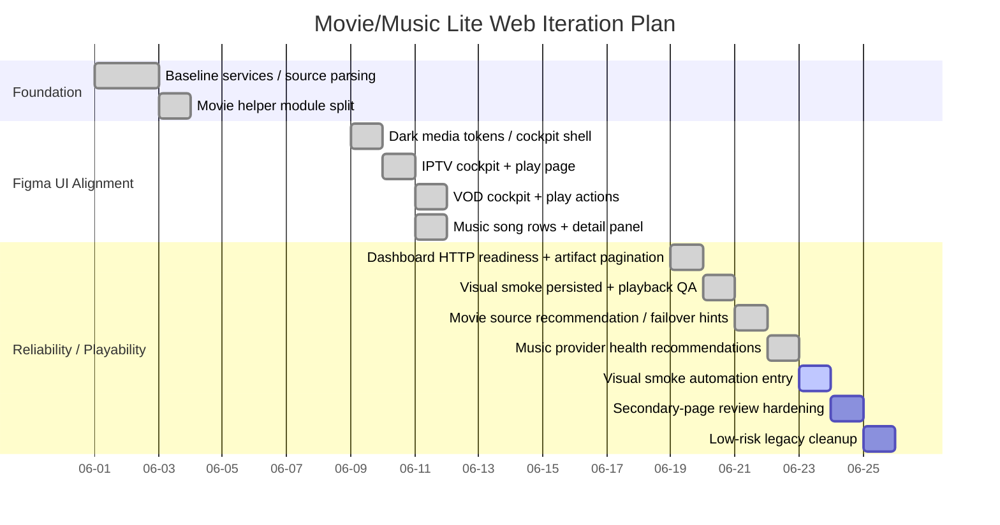

# OpenClaw Media Web Progress

更新时间：2026-06-19

## 当前目标

把 Movie Lite / Music Lite 从“能用的自用工具页”迭代成轻量、可维护、可验证的 Web 工具，同时保持：

- Movie Lite / Music Lite 独立服务
- 不引入 React/Vite/FastAPI/Redis/Postgres
- 不做流代理、不缓存视频/音乐内容
- 小 VPS 低成本运行
- 每轮 tests → service restart → live smoke → visual smoke

## Gantt



## Status Board

### Done

- Movie Lite / Music Lite production services active behind nginx.
- Movie helper modules extracted: `db_store.py`, `iptv.py`, `ranking.py`, `vod_sources.py`.
- IPTV homepage optimized from full hidden DOM to limited render (`show_all=1` for full list).
- Movie/VOD/IPTV aligned to dark Figma media cockpit style.
- Music search changed toward song-row + detail/queue/lyrics panel.
- IPTV route playability categories added: HTTPS/HLS, HTTP mixed content, non-browser protocol, needs headers, unknown.
- IPTV playback page quick switch/recommended route action added.
- VOD failure recovery panel added with true same-title source switcher.
- Dashboard sub-service readiness now includes HTTP readiness markers.
- Artifacts page has real pagination and delivery grouping.
- `/visual-smoke` shows report age, runner path, rerun command, screenshot matrix, and Movie/Music playback QA.
- Movie source switching now ranks safer sources first and names the recommended failover source on playback failure.
- Music source health page/API now summarizes failing providers and recommends fallback action.

### In Progress

- Visual smoke automation entry: make the existing runner + playback QA easy to execute and inspect from Dashboard without relying on memory.

### Next

1. Add a safe manual/CLI visual-smoke automation entry and surface last-run command/evidence.
2. Strengthen secondary-page review tracking for `movie-category`, `music-search-results`, and `movie-detail`.
3. Remove or isolate unused Music legacy CSS after tests protect the served static CSS.

## Current Risks / Notes

- Dashboard previously fell back to backup `WEB_PROGRESS.md`; primary file is restored here and should remain source of truth.
- Music tests can still depend on upstream behavior if not mocked; keep critical fallback tests mocked.
- Public domain may be behind auth; loopback smoke is the functional check.
- Keep raw URLs behind debug/details; do not make them primary UI.

## Verification Commands

```bash
cd /opt/agent-ops-dashboard && python3 test_dashboard_features.py
cd /opt/movie-lite && python3 test_iptv.py && python3 test_search_rank.py
cd /opt/music-lite && python3 test_music_lite.py
systemctl restart agent-ops-dashboard.service movie-lite.service music-lite.service
cd /opt/visual-smoke-runner && node visual-smoke.js && node media-playback-qa.js > /opt/agent-ops-dashboard/visual-smoke/media-playback-qa-report.json
```
